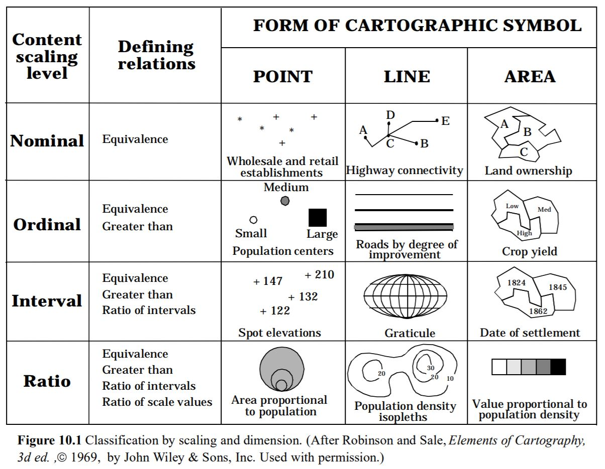
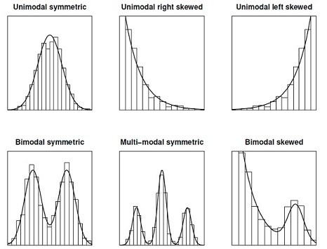
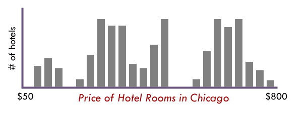

# SPATIAL DATA CONCEPTS AND VISUALIZATION
## GEOG 350 - FALL 2017

### Donald J. Biddle
---
### The Plan 
- Talk about Geographic Scale |
 - What is it? How do we represent it? Large scale vs small scale.
 - What are the effects/limitations of scale?
 - How do we make decisions about scale in our mapping efforts?
- Talk about Scale of Measurement | 
 - What are *levels* of data?
 - What is data normalization?
---
### The Plan
- Talk about Thematic Mapping |
 - Data Classification > Choropleth Mapping 
 - Ways to classify data
 - The role of color/shading
- Other ways to represent data |
 - Dot Density
 - Proportional Symbols
 - Cartograms
 - Vector Fields
---
## Geographic *(Map)* Scale
  >*The ratio of a distance on a map to the corresponding distance on the ground* 
---
### Representing Map Scale
- Representative Fraction |
 - 1:24,000
- Textual Scale |
 - *One inch equals 24,000 inches*
 - *1" = 2,000'*
- Graphical Scale |
 - Scale Bars
 - 
---
### Large or Small Scale?? 
- #### Easy way to remember: 
 - >*Features appear **larger** in **large** scale maps, and **smaller** in **small** scale maps* 
- #### CAUTION! |
 - >A large denominator ≠ a large scale map! |
---

---
#### Examples of large vs. small scale maps

---
### Limitations/Effects of Scale
#### Simply put: Tradeoff between detail and extent
- ###### Large Scale Maps > High detail, limited area |
- ###### Small Scale Maps > Large extent, limited detail |
---
### Scale Effects
- **Cartographic Generalization**
 - Deriving a smaller scale map from large scale map data |
 - Abstraction of higher level data to lower level data |
 - Loss of detail/Omission of key features |
 - The "Baltimore Phenomenon" |
---
### Generalization

Note: Simplification – Removing points
Smoothing – Replacing sharp and complex bends with smoother ones
Collapse – Areas become combinations of lines and points
Aggregation – individual objects are replaced by a smaller number of new objects
---
### Generalization

Note: Amalgamation – Several Area objects become one single area
Merge – Several lines become one line
Refinement – Replacing complex patterns with a simple pattern preserving general form
Exaggeration – Enlarging object to preserve it at smaller scales
---
### The Coastline Paradox
> The measured length of a feature is inversely proportional to its unit of measure.
> The smaller the unit of measure, the longer the measured length!

https://youtu.be/I_rw-AJqpCM 
--- 
## DATA SCALE
### or SCALE OF MEASUREMENT
> How are *attributes* measured? 

- Four main scales of data:
 - Nominal: Each value is a unique meaning |
 - Ordinal: Each value is ranked in relation to other values |
 - Interval: The scale unit is fixed |
 - Ratio: The scale has a true zero value |
---
#### Nominal Data
- Categorical/Descriptive 
- Numbers have no mathematical value, only used as labels 
- Operations: = , ≠
- Example: Land Use Classification
---
#### Ordinal Data
- Rankings
- 1st, 2nd, 3rd, etc. 
- Distance between adjacent values could vary widely
- Operations: < , >
- Example: Top ten countries by population
---
#### Interval Data
- Data points are measured on a fixed scale
- Data scale **has no true zero value**, and negatives are possible
- Operations: + , - 
- Examples: Temperature on Celsius Scale, Time/Date from 0CE  
---
#### Ratio Data
- Data scale has a true/absolute zero value
- Negative values not possible
- Operations: * , /
- Examples: Daily precipitation, population, Temp in Kelvin
---
#### Scales of Spatial Data

---
### THEMATIC MAPS
- Display information about a single attribute/phenomenon
- As opposed to a *reference map*, showing general information about an area
- Can be designed to show data in any scale...
---
#### THEMATIC MAP: NOMINAL DATA

##### Geologic Map
---
#### THEMATIC MAP: ORDINAL DATA

##### Cancer Risk Map
---
#### THEMATIC MAP: INTERVAL DATA

##### Soil pH Map
---
#### THEMATIC MAP: RATIO DATA

##### Population Density Map
---
### CHOROPLETH MAPS
- Thematic mapping on a single numerical attribute
- Use coloring, shading, or different symbols to represent the average value over an area
- The "bar chart" of the mapping world
---

---
### DATA CLASSIFICATION
- Breaking a range (distribution) of values into *n* classes
- Reducing the complexity of a dataset into something more interpretable
- Rescaling data from interval/ratio data > ordinal data
- The basis for choropleth mapping
---
### DATA DISTRIBUTIONS
###### the "shape" of our data
- 
---
### HISTOGRAMS
###### Depict the distribution of data values

---
### CLASSIFICATION METHODS
- Where do we define the breakpoints in our dataset?
- Three main methods:
 - Equal Interval: divides the range of attribute values into equal-sized subranges. **Rectangular distributions**
 - Quantile: Each class contains an equal number of features. **Recatangular distributions**
 - Natural Breaks: based on natural groupings of data. Maximizes in group similarity, minimizes out of group differences. **Uneven/skewed/multimodal distributions**
---
  |

	