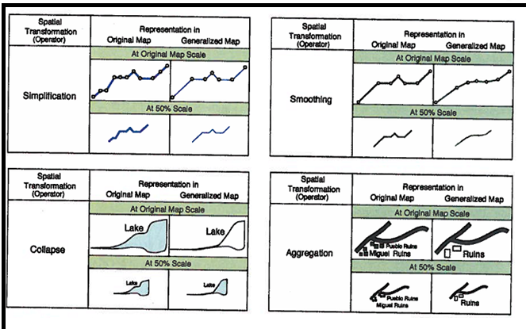
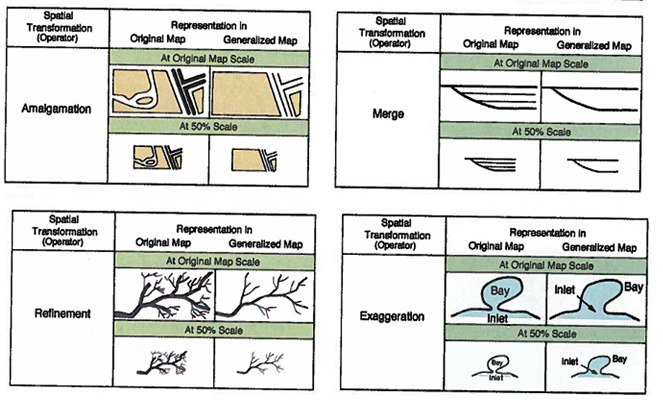

# SPATIAL DATA CONCEPTS AND VISUALIZATION
## GEOG 350 - FALL 2017

### Donald J. Biddle
---
### The Plan 
- Talk about Geographic Scale |
 - What is it? How do we represent it? Large scale vs small scale.
 - What are the effects/limitations of scale?
 - How do we make decisions about scale in our mapping efforts?
- Talk about Scale of Measurement | 
 - What are *levels* of data?
 - What is data normalization?
---
### The Plan
- Talk about Thematic Mapping |
 - Data Classification > Choropleth Mapping 
 - Ways to classify data
 - The role of color/shading
- Other ways to represent data |
 - Dot Density
 - Proportional Symbols
 - Cartograms
 - Vector Fields
---
## Geographic *(Map)* Scale
 - >*The ratio of a distance on a map to the corresponding distance on the ground* |
---
### Representing Map Scale
- Representative Fraction |
 - 1:24,000
- Textual Scale |
 - *One inch equals 24,000 inches*
 - *1" = 2,000'*
- Graphical Scale |
 - Scale Bars
 - 
---
### Large or Small Scale?? 
- #### Easy way to remember: |
 - >*Features appear **larger** in **large** scale maps, and **smaller** in **small** scale maps* |
- #### CAUTION! |
 - >A large number ≠ a large scale map! 
---

---
#### Examples of large vs. small scale maps

---
### Limitations/Effects of Scale
#### Simply put: Tradeoff between detail and extent
- ###### Large Scale Maps > High detail, limited area |
- ###### Small Scale Maps > Large extent, limited detail |
---
### Scale Effects
- **Cartographic Generalization**
 - Deriving a smaller scale map from large scale map data |
 - Abstraction of higher level data to lower level data |
 - Loss of detail/Omission of key features |
 - The "Baltimore Phenomenon" |
---
### Generalization

Note: Simplification – Removing points
Smoothing – Replacing sharp and complex bends with smoother ones
Collapse – Areas become combinations of lines and points
Aggregation – individual objects are replaced by a smaller number of new objects
---
### Generalization

Note: Amalgamation – Several Area objects become one single area
Merge – Several lines become one line
Refinement – Replacing complex patterns with a simple pattern preserving general form
Exaggeration – Enlarging object to preserve it at smaller scales
---
### The Coastline Paradox
> The measured length of a feature is inversely proportional to its unit of measure.
> The smaller the unit of measure, the longer the measured length!

https://youtu.be/I_rw-AJqpCM 
--- 
## DATA SCALE
###SCALE OF MEASUREMENT
	