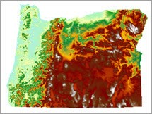

## Representiing Spatial Data
## GEOG 558 - Intro to GIS

#### Donald J. Biddle, GISP
---
### The Plan 
- Basics of Symbology |
 - Fundamental properties
 - Types of maps
- Scale of Measurement | 
 - What are *levels* of data?
 - What is data normalization?
---
### The Plan
- Talk about Thematic Mapping |
 - Data Classification > Choropleth Mapping 
 - Ways to classify data
 - The role of color/shading
---
## Basics of map symbols

We are mainly trying to differentiate features based on **category** or **quantity**. 

Depending on feature geometry we have several ways to do so... 

 
+++
### Types of maps

Different maps for different types of data...

- For nominal/categorical or ordinal data
    - single symbol
	- unique values
- For numerical data
    - graduated color
	- graduated symbol
	- dot density
	- chart maps

--- 
## DATA SCALE
### or SCALE OF MEASUREMENT
> How are *attributes* measured? 

- Four main scales of data:
 - Nominal: Each value is a unique meaning |
 - Ordinal: Each value is ranked in relation to other values |
 - Interval: The scale unit is fixed |
 - Ratio: The scale has a true zero value |
+++
@snap[west span-40]

@snapend

@snap[east span-40]
@box[bg-blue text-white waved box-padding](Nominal Data# - Categorical or Descriptive  - Numbers have no mathematical value, only used as labels - Operations: = , ≠ - Example: Land Use Classification)
@snapend
+++

@snap[west span-40]

@snapend

@snap[east span-40]
@box[bg-blue text-white waved box-padding](Ordinal Data# - Rankings - 1st, 2nd, 3rd, etc.  - Distance between adjacent values could vary widely - Operations: < , >  - Example: Habitat Suitability)
@snapend
+++
@snap[west span-40]

@snapend

@snap[east span-40]
@box[bg-blue text-white waved box-padding](Interval Data# - Measured on a fixed scale - **No true zero**  - Negative values possible - Operations: + , -  - Example: Elevation)
@snapend
+++
@snap[west span-40]

@snapend

@snap[east span-40]
@box[bg-blue text-white waved box-padding](Ratio Data# - **Has true zero** - Negatives not possible  - Operations: x , /  - Population)
@snapend
+++
	#### Scales of Spatial Data

---
### THEMATIC MAPS
- Display information about a single attribute/phenomenon
- As opposed to a *reference map*, showing general information about an area
- Can be designed to show data in any scale...
+++
#### THEMATIC MAP: NOMINAL DATA

##### Geologic Map
+++
#### THEMATIC MAP: ORDINAL DATA

##### Cancer Risk Map
+++
#### THEMATIC MAP: INTERVAL DATA

##### Soil pH Map
+++
#### THEMATIC MAP: RATIO DATA

##### Population Density Map
---
### CHOROPLETH MAPS
- Thematic mapping on a single numerical attribute
- Use coloring, shading, or different symbols to represent a quantity or average value over an area
- The "bar chart" of the mapping world
+++

+++
### DATA CLASSIFICATION
- Breaking a range (distribution) of values into *n* classes
- Reducing the complexity of a dataset into something more interpretable
- Rescaling data from interval/ratio data > ordinal data
- The basis for choropleth mapping
+++
### DATA DISTRIBUTIONS
###### the "shape" of our data

+++
### HISTOGRAMS
###### Depict the distribution of data values

+++
### CLASSIFICATION METHODS
- Where do we define the breakpoints in our dataset? **How many classes are appropriate?**
- Four main methods:
 - Equal Interval: divides the range of attribute values into equal-sized subranges. **Rectangular distributions**
 - Quantile: Each class contains an equal number of features. **Recatangular distributions**
 - Natural Breaks: based on natural groupings of data. Maximizes in group similarity, minimizes out of group differences. **Uneven/skewed/multimodal distributions**
 - Standard Deviations: Classifies data with respect to mean value. 
+++
 
+++
### EQUAL INTERVAL

+++
### QUANTILE

+++
### NATURAL BREAKS

+++
### STANDARD DEVIATION

+++
### MANUAL BREAKS

+++
### GUIDING THOUGHTS
- Classification decisions dictate how your audience interprets the data. 
- Your opportunity to control the narrative! 
- Select a classification method and number of classes that highlight **your** message.
- Visual impact dominates perception! Color and size are first impression.
- How to lie with maps! http://www.markmonmonier.com/how_to_lie_with_maps_14880.htm 
+++
### THE ROLE OF COLOR
- Color impacts the way a reader interprets data
 - Use different colors for unique values 
 - Use shades of same hue for sequential data
 - Use shades of two colors for divergent data
 - Most can't distinguish more than seven colors...classes begin to blur
+++

+++
### THE ROLE OF COLOR 
- Avoid bold/brash colors...pastel hues more eye pleasing
- Blues/greens easier to differentiate than reds/oranges
- Use greyscale tones to de-emphasize unimportant data
- Pay attention to prevailing color associations 
 - e.g. radar maps
+++
### INCORRECT USE OF COLOR!

+++
### NON-INTUITIVE USE OF COLOR

+++
### BETTER CHOICE

+++
### COLOR BREWER
##### http://colorbrewer2.org/
---
### Unclassed Maps
To avoid subjective groupings or breaks in data...
- **Proportional symbol** maps increase size in proportion to the data value.
- **Dot density** maps place random points within a polygon based on a specified ratio (1 dot: 1000 people).
+++
##### Proportional Symbols

+++
##### Dot Density

+++
### The End

 
 
 

	